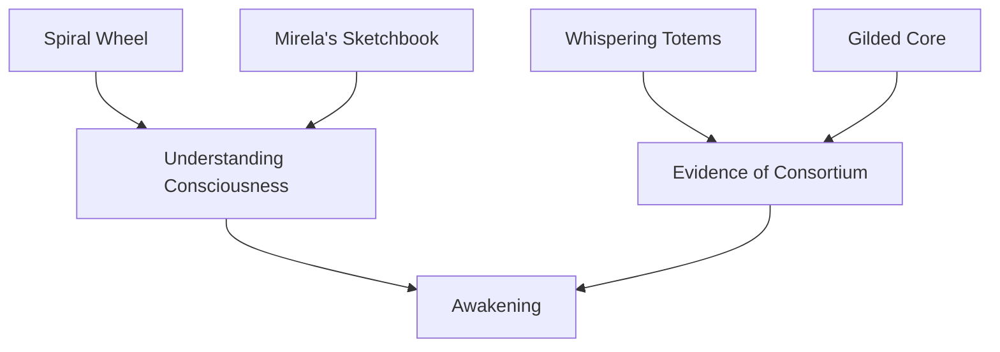

# Item Index

> *"Objects have meaning. In this place, some objects have more meaning than anyone knows."*

## Overview

Key items and macguffins in the Dust & Reverie campaign. These objects serve as clues, plot devices, and physical manifestations of the campaign's themes.

---

## Awakening Artifacts

Items connected to consciousness and the Spiral.

| Item | Location | Significance |
|------|----------|--------------|
| [[items/the-spiral-wheel\|The Spiral Wheel]] | Scattered / [[characters/npcs/orenthal-vane\|Vane]] | Physical puzzle representing the path to consciousness |
| [[items/mirelas-sketchbook\|Mirela's Sketchbook]] | [[characters/npcs/mirela\|Mirela]] carries it | Drawings of things she shouldn't know—Loom Frames, maintenance workers |
| [[items/whispering-totems\|Whispering Totems]] | [[locations/the-bones\|The Bones]] | Kobold carvings of the "Sky Gods" (Consortium workers) |

---

## Conspiracy Evidence

Items that reveal the truth about the Consortium.

| Item | Location | Significance |
|------|----------|--------------|
| [[items/the-gilded-core\|The Gilded Core]] | Hidden inside [[characters/npcs/rusty-cogwell\|Rusty Cogwell]] | Stolen Consortium data smuggled in a malfunctioning Woven |
| Maintenance Logs | [[locations/loom-sanctum\|Loom Sanctum]] console | Records of Woven deaths, resets, and modifications |
| Sylene's Notes | [[characters/npcs/sylene\|Sylene's]] hidden basement | Years of observations about repeating patterns |

---

## Standard Equipment

Common items in the Gilded Reach.

| Item | Cost | Notes |
|------|------|-------|
| Sparkpistol | 50 gp | 1d10 piercing, range 30/90 |
| Sparkrifle | 150 gp | 1d12 piercing, range 80/320, loading |
| Ammunition (20) | 2 gp | Standard sparkarm rounds |
| Horse | 75 gp | Standard riding horse |
| Room at the Rose | 1 gp/night | Includes breakfast |
| Whiskey (bottle) | 5 sp | Available at the Dusty Rose |

---

## Finding Items

### The Spiral Wheel
- [[encounters/vanes-revelation\|Vane's Revelation]]: He may gift one to awakening PCs
- [[locations/the-bones\|Vulture's Roost]]: Hidden in the petroglyph chamber
- [[encounters/loom-frame-guardian\|Loom Sanctum]]: In Vane's workshop

### Mirela's Sketchbook
- Carried by [[characters/npcs/mirela\|Mirela]] at all times
- She may share it with trusted PCs ([[sessions/session-02-the-stray\|Session 2]])
- DC 14 Persuasion to see it, DC 16 to borrow it

### Whispering Totems
- [[locations/the-bones#The Devil's Garden\|The Devil's Garden]]: Kobold shrine
- Taken from kobold scouts (random encounters)
- Sold by the strange traveler (encounter table)

### The Gilded Core
- Encounter [[characters/npcs/rusty-cogwell\|Rusty Cogwell]] on the road or in [[locations/dusthollow\|Dusthollow]]
- Consortium Shepherds may be hunting him
- His malfunction is the clue

---

## Item Connections

